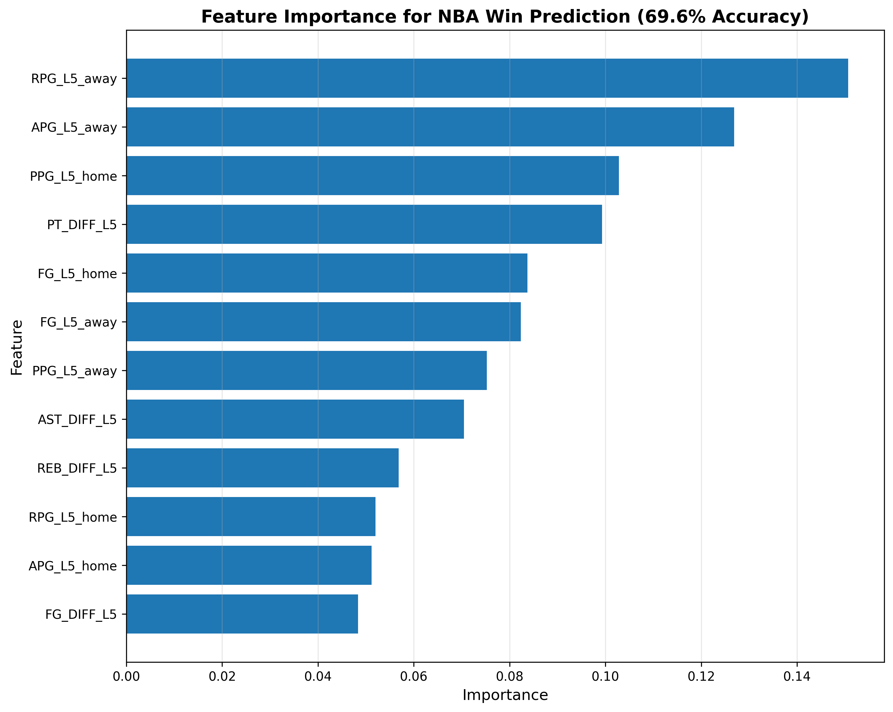

# NBA Game Win Prediction Model

A machine learning project that predicts NBA game outcomes with **69.6% accuracy** using rolling performance statistics and XGBoost classification.

## Project Overview

This model predicts whether the home team will win based on recent team performance metrics. It beats the NBA historical baseline of ~60% home team win rate, demonstrating that recent form and relative team strength are strong predictors of game outcomes.

**Key Achievement:** Improved from 54% (worse than random) to 69.6% accuracy through proper feature engineering and data pipeline optimization.

---

## Model Performance

- **Accuracy:** 69.6%
- **Baseline:** 60% (approximate NBA home team historical win rate)
- **Dataset:** 41,321 games (after cleaning)
- **Features:** 12 engineered features from rolling statistics
- **Algorithm:** XGBoost Classifier
- **Validation:** Chronological train/test split (80/20)

---

## Key Features

### Rolling Averages (5-game windows):
- Points per game (PPG_L5)
- Rebounds per game (RPG_L5)
- Assists per game (APG_L5)
- Field goal percentage (FG_L5)

### Differential Features:
- Point differential (PT_DIFF_L5)
- Rebound differential (REB_DIFF_L5)
- Assist differential (AST_DIFF_L5)
- FG% differential (FG_DIFF_L5)

All features use proper time-series validation with `.shift(1)` to prevent data leakage.

---

## Feature Importance Analysis



**Top 3 Predictors:**
1. **RPG_L5_away (15%)** - Away team's recent rebounding
2. **APG_L5_away (13%)** - Away team's recent assists
3. **PPG_L5_home (10%)** - Home team's recent scoring

**Key Insight:** Away team performance (rebounds + assists) is the strongest predictor, suggesting strong away teams can overcome home court advantage by dominating the boards and ball movement.

---

## Technical Implementation

### Data Pipeline
```
Raw CSV (26,651 games)
    ↓
Clean NaN values → 26,552 games
    ↓
Single-pass rolling feature engineering
    ↓
Create differential features
    ↓
Drop NaN from rolling windows → 41,321 games
    ↓
Chronological 80/20 split
    ↓
XGBoost training & evaluation
```

### Architecture Decisions

**Single-Pass Feature Engineering:**
- Calculates all rolling statistics in one pass
- Performs only 2 merges (home + away) instead of 8
- Prevents cascading dataframe duplication
- Original approach caused 26K → 10M row explosion

**Proper Time-Series Validation:**
- Chronological split (train on past, test on future)
- Rolling windows use `.shift(1)` to only use past data
- No data leakage from future games

---

## Challenges resolved

### 1. Memory Explosion (26K → 10M rows)
**Problem:** Iterative merging caused cascading duplication
```python
# Broken: 4 function calls = 8 merges
games = rolling_avg(games, 'PTS', 5, 'PPG_L5')
games = rolling_avg(games, 'REB', 5, 'RPG_L5')
# ... each merge multiplied duplicates

# Fixed: Single-pass = 2 merges
games = create_all_rolling_features(games)
```

**Solution:** Batch process all features, merge once per team type

### 2. Low Accuracy (54% → 69.6%)
**Problem:** 
- Missing differential features (relative team strength)
- NaN values corrupting training data
- Data leakage from improper feature engineering

**Solution:**
- Added differential features (PT_DIFF, REB_DIFF, etc.)
- Proper NaN handling with `dropna()` after feature creation
- Time-series validation with chronological splits

### 3. Pandas Merge Complexity
**Problem:** Index corruption, duplicate keys, column naming conflicts

**Solution:**
- `reset_index(drop=True)` after every sort
- `drop_duplicates()` on merge keys
- Explicit column renaming before merges
- Debug prints after each operation

---

## Project Structure
```
nba_pred/
├── main.py                    # Main training pipeline
├── feature_funcs.py           # Feature engineering functions
├── nba_games/
│   └── games.csv             # Raw NBA game data
├── feature_importance.png     # Visualization
└── README.md                 # This file
```

---

## Usage

### Requirements
```bash
pip install pandas numpy xgboost scikit-learn matplotlib
```

### Run the Model
```bash
python main.py
```

### Output
```
Before cleaning: 26651 games
After cleaning: 26552 games
created all rolling averages - 41342 rows
Before dropna: 41342 games
After dropna: 41321 games

Model accuracy: 69.55837870538414%

Significant Feature Importances:
----------------------------------------
RPG_L5_away         : 0.1507
APG_L5_away         : 0.1269
PPG_L5_home         : 0.1028
PT_DIFF_L5          : 0.0993
...
```

---

## Key Learnings

### Data Cleaning
- Always validate row counts after merges
- Reset indices after sorting operations
- Drop duplicates before merging
- Handle NaN values at the right pipeline stage
- Use chronological splits for time-series data

### Feature Engineering
- Differential features > raw features for competitive scenarios
- Rolling windows need proper shifting to prevent leakage
- Batch processing > iterative processing for merge operations

### Model Insights
- Away team recent performance matters more than expected
- Point differential is important but not dominant (10%)
- Home court advantage can be overcome by strong road teams

---

## Future Improvements

- [ ] Add rest days / back-to-back game indicators
- [ ] Include opponent strength metrics
- [ ] Add playoff vs regular season context
- [ ] Experiment with different window sizes (3-game vs 10-game)
- [ ] Try ensemble models (XGBoost + LightGBM)
- [ ] Add win streak / momentum features
- [ ] Predict point spreads (regression task)

---

## Notes

**Why 69.6% and not 80%+?**

NBA games have inherent randomness:
- Injuries, referee calls, clutch moments
- Even Vegas odds makers struggle with precision
- 69.6% beating the 60% baseline shows the model captures real signal

**Dataset Considerations:**
- Historical data (2003-2023)
- No player-level stats (team-level only)
- No injury/roster information
- No advanced metrics (net rating, pace, etc.)

Despite these limitations, the model demonstrates strong predictive power through careful feature engineering.

---

## Contact

For questions or collaboration: [Your Email/GitHub]

---

## Acknowledgments

Dataset: https://www.kaggle.com/datasets/nathanlauga/nba-games

Built as part of a data science portfolio to demonstrate:
- Time-series ML validation
- Feature engineering creativity
- Data pipeline optimization
- Problem-solving through debugging complex issues

---

**Last Updated:** January 2025